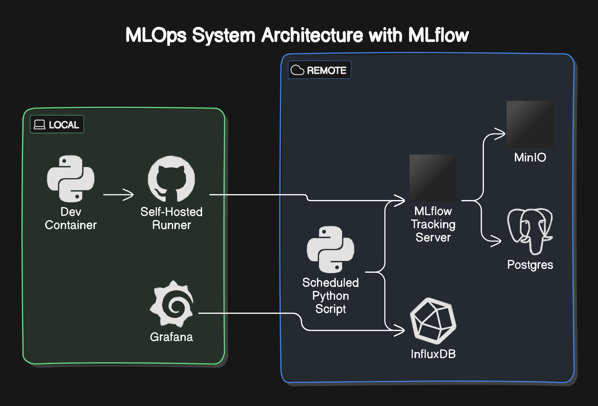

# mlbot2

## システム構成図



- local
  - 開発コンテナ
    - データ分析やbot本体のコーディングを行う
  - GitHub Actions self-hosted runner用コンテナ
    - ユニットテスト、学習パイプライン実行用
    - docker in docker
    - リモートマシンのリソース節約のために開発マシン内で動かしているが、必ずしもそのようにする必要はない。
  - Grafanaコンテナ
    - botが記録したヒストリカルデータや、取引記録を表示する
    - runnerコンテナと同様、開発マシンでなくてよい
- remote
  - MLflow tracking server用コンテナ
    - MLflow tracking server
  - MinIOコンテナ
    - MLflowのArtifact用
    - 特徴量ストア、モデルストアとして使う
  - PostgreSQLコンテナ
    - MLFlowのArtifact以外用
  - InfluxDBコンテナ
    - 時系列データ格納用
    - OHLCVデータ、ウォレット残高、売買記録等を保存する
  - Bot用コンテナ
    - Bot本体をcronで動かす

## 環境変数

- `.env.sample`,`.env.dev.sample`の`.sample`を削除して使用する
- `.env.dev`は基本的にローカルでの使用を想定している
- 例えば`MLFLOW_S3_ENDPOINT_URL=http://{hogehoge}:9000`の`{hogehoge}`部分
  - `.env`では`docker-compose-mlflow.yml`でのサービス名が入る
  - `.env.dev`ではリモートマシンのIPアドレスが入る

## コンテナ起動

4つのdocker-compose.ymlがある。

- `docker-compose-dev.yml`
  - 開発コンテナ、runnerコンテナ用
  - ローカルで起動
  - 2種類の`.env`を適用したいので`docker compose -f docker-compose-dev.yml --env-file .env --env-file .env.dev up -d`
- `docker-compose-bot.yml`
  - bot本体用
  - リモートで起動
- `docker-compose-mlflow.yml`
  - mlflow tracking server, PostgreSQL, MinIO 用
  - リモートで起動
- `docker-compose.yml`
  - grafana用
  - ローカルで起動

## influxdbの設定

- パスワードの設定、.envに書く
- tokenの作成、.envに書く
- バケット作成
  - TODO 自動作成
  - 以下5つのバケットを手動で作成する
    - account : 口座残高等
    - ohlcv : ohlcvデータ
    - market : ohlcv以外のマーケットデータ
      - LS比
      - OpenInterest
    - trade : トレード履歴
      - 平均価格
      - 枚数
      - 指値価格
    - log : 定期実行の履歴

## GitHub Actions

### 環境変数(GitHubで設定する)

`.env`,`.env.dev`ファイルと同じにする。
※`.env`,`.env.dev`の両方にある変数は、runnerを開発用マシンと同じにする場合は`.dev.env`に記載の内容を優先する

- ACCESS_TOKEN_GITHUB_ACTIONS
- AWS_ACCESS_KEY_ID
- AWS_SECRET_ACCESS_KEY
- INDIGO_IP_ADDRESS
- INDIGO_PORT
- INFLUXDB_ORGANIZATION
- INFLUXDB_TOKEN
- INFLUXDB_URL
- MLFLOW_S3_ENDPOINT_URL
- MLFLOW_TRACKING_URI
- POSTGRES_DB
- POSTGRES_HOST
- POSTGRES_PASSWORD
- POSTGRES_PORT
- POSTGRES_USER

## Bot起動手順 (botコンテナ内で実行)

シンボリックリンクを設定

TODO DockerfileのCOPYを削除する、そうしないとシンボリックリンク張るときにエラーが出る

```bash
ln -s  /home/pyuser/project/docker/bot/cron1m.sh /root/script/cron1m.sh
ln -s  /home/pyuser/project/docker/bot/cron5m.sh /root/script/cron5m.sh
ln -s  /home/pyuser/project/docker/bot/cron15m.sh /root/script/cron15m.sh
```

crontabを設定 (PATHの設定がないと実行できない)

```bash
PYTHONPATH=/home/pyuser/project/src
PATH=/usr/local/bin:/usr/local/sbin:/usr/local/bin:/usr/sbin:/usr/bin:/sbin:/bin

*/15 * * * * sh /root/script/cron15m.sh
*/5 * * * * sh /root/script/cron5m.sh
*/1 * * * * sh /root/script/cron1m.sh
```

最新のbot反映は`git pull origin main`で行う (github actions の deploy job も中身は同じ想定、整備中)

## その他

- mlflow x nginx_proxy のためのホスト側での設定

<https://zenn.dev/mjun0812/articles/192f4d4c5a14ab>

```bash
cd nginx/htpasswd
htpasswd -c [domain名] [username]
```

- 環境変数等で`indigo`とあるが、使用しているレンタルサーバの名前なので、何でもよい
