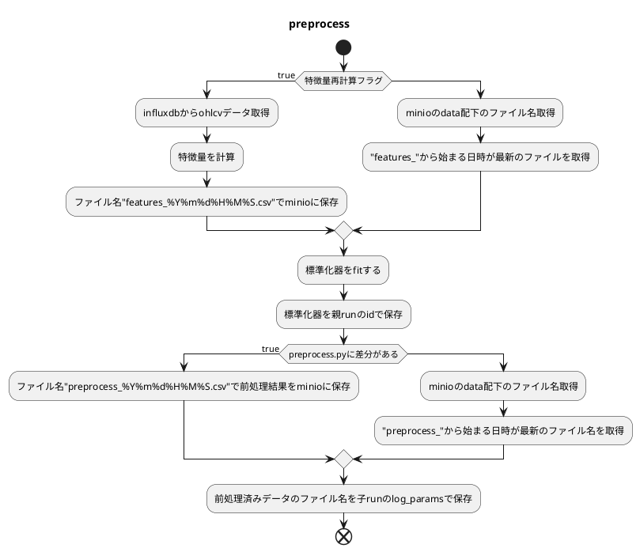

```plantuml
@startuml preprocess
title preprocess

start

if (特徴量再計算フラグ) then (true)
:influxdbからohlcvデータ取得;
:特徴量を計算;
:ファイル名"features_%Y%m%d%H%M%S.csv"でminioに保存;
else
:minioのdata配下のファイル名取得;
:"features_"から始まる日時が最新のファイルを取得;
endif
:標準化器をfitする;
:標準化器を親runのidで保存;
if (preprocess.pyに差分がある) then (true)
:ファイル名"preprocess_%Y%m%d%H%M%S.csv"で前処理結果をminioに保存;
else
:minioのdata配下のファイル名取得;
:"preprocess_"から始まる日時が最新のファイル名を取得;
endif
:前処理済みデータのファイル名を子runのlog_paramsで保存;
end
@enduml
```
